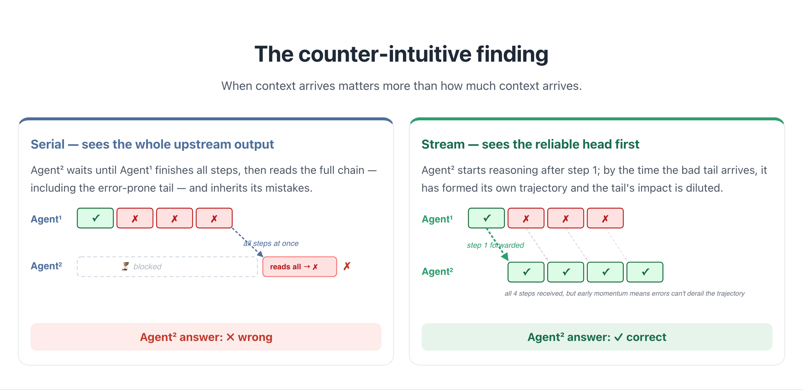
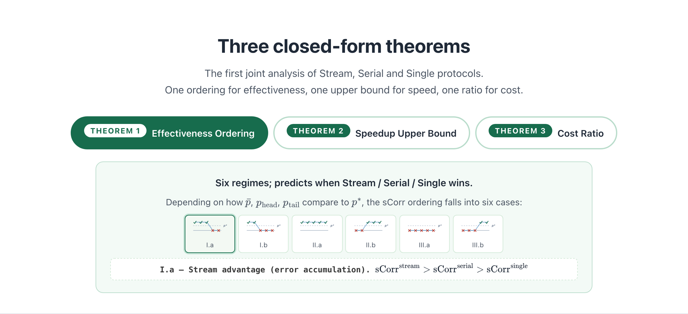
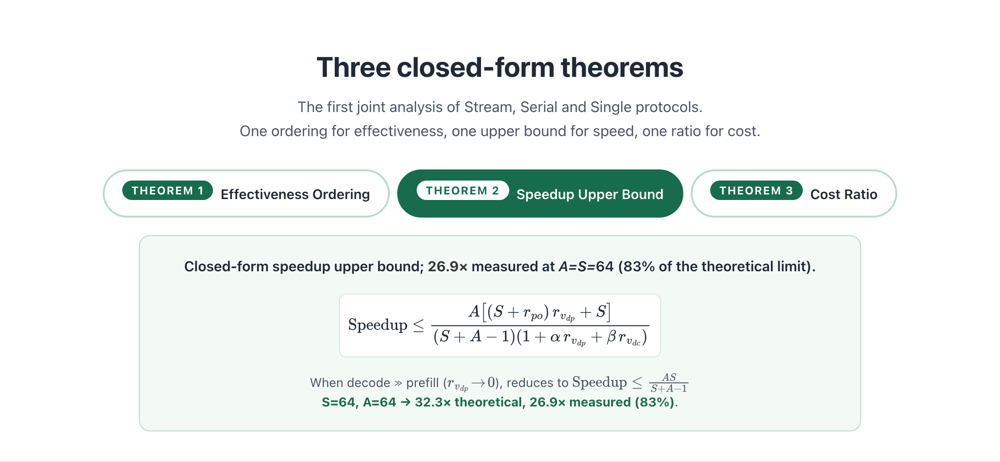
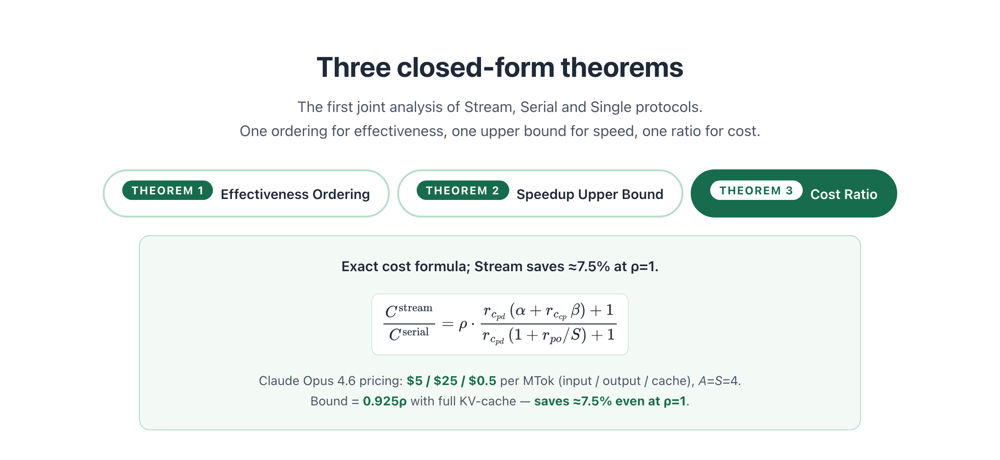
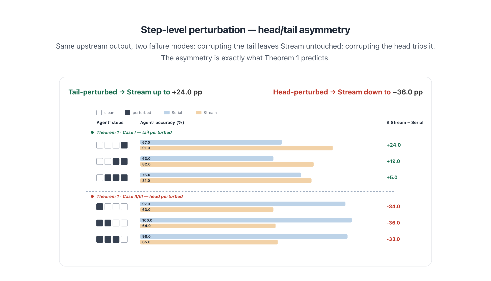
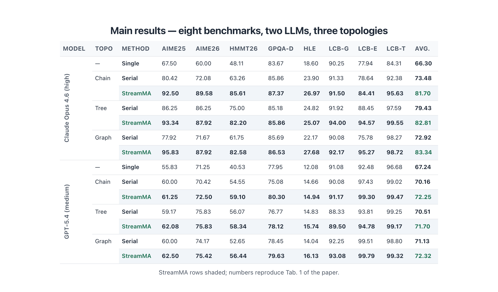
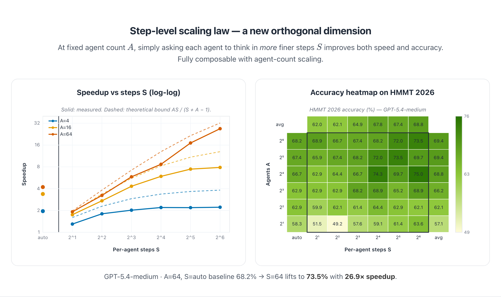
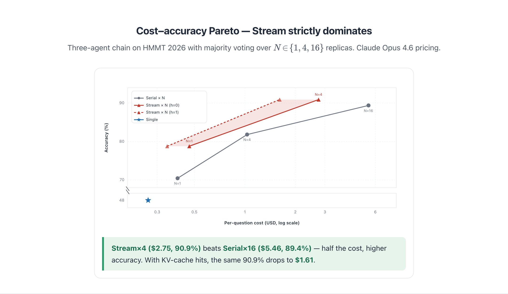

<h1 align="center">
  <picture>
    <source media="(prefers-color-scheme: dark)" srcset="imgs/favicon.svg">
    
  </picture>
  <br>
  StreamMA
</h1>

<p align="center">
  <b><i>Streaming Communication in Multi-Agent Reasoning</i></b><br>
  <sub>Let downstream agents start working <i>before</i> upstream agents finish.</sub>
</p>

<p align="center">
  <a href="https://arxiv.org/abs/2606.05158">
    </a>
  <a href="https://zhenyangcs.github.io/StreamMA-website">
    </a>
  <a href="#citation">
    </a>
  <!--
  <a href="#">
    </a>
  <a href="#">
    </a>
  -->
</p>

<p align="center">
  <a href="https://zhenyangcs.github.io/"><b>Zhen&nbsp;Yang</b></a><sup>1</sup> &nbsp;·&nbsp;
  <a href="https://xuxiaogang.com/"><b>Xiaogang&nbsp;Xu</b></a><sup>3</sup> &nbsp;·&nbsp;
  <a href="https://encounter1997.github.io/"><b>Wen&nbsp;Wang</b></a><sup>3</sup> &nbsp;·&nbsp;
  <a href="https://scholar.google.com/citations?user=kwDXTpAAAAAJ&hl=en"><b>Cong&nbsp;Chen</b></a><sup>3</sup>
  <br>
  <a href="https://xander23333.github.io/index.html"><b>Xander&nbsp;Xu</b></a><sup>2&#42;</sup> &nbsp;·&nbsp;
  <a href="https://scholar.google.com/citations?user=n7j4bJUAAAAJ&hl=en"><b>Ying-Cong&nbsp;Chen</b></a><sup>1,4&#42;</sup>
  <br><br>
  <sup>1</sup>HKUST(GZ) &nbsp;·&nbsp; <sup>2</sup>Alibaba&nbsp;Group &nbsp;·&nbsp; <sup>3</sup>ZJU &nbsp;·&nbsp; <sup>4</sup>HKUST
  <br>
  <sub><sup>&#42;</sup>Co-corresponding authors</sub>
</p>

---

<!--
<h2 align="center">🏆 SimpleBench — StreamMA sets a new SOTA</h2>

<div align="center">

| Rank | Model | Score |
|:----:|:------|------:|
| 🥇 | **StreamMA**&nbsp;<sub>(GPT-5.4-medium, A4 S4)</sub> | **98.0%** |
| 1 | Gemini 3.1 Pro Preview | 79.6% |
| 2 | GPT-5.5 Pro | 76.9% |
| 3 | Gemini 3 Pro Preview | 76.4% |
| 4 | GPT-5.4 Pro | 74.1% |
| 5 | GPT-5.5 | 69.0% |

</div>

<p align="center"><sub>Source: <a href="https://epoch.ai/benchmarks/simplebench">epoch.ai/benchmarks/simplebench</a> · StreamMA evaluated on 10 public questions, 5 runs avg.</sub></p>

-->
---

<h2 align="center">📊 TL;DR</h2>

<p align="center">
  
</p>

<table align="center">
<tr>
  <td align="center" width="33%">
    <h2>+7.3&nbsp;pp</h2>
    <b>Average accuracy gain</b><br>
    <sub>8 benchmarks · Claude Opus 4.6<br>peak <b>+22.4 pp</b> on HMMT 2026</sub>
  </td>
  <td align="center" width="33%">
    <h2>26.9×</h2>
    <b>Wall-clock speedup</b><br>
    <sub>A=64, S=64<br>83% of theoretical bound</sub>
  </td>
  <td align="center" width="34%">
    <h2>½ cost</h2>
    <b>Stream×4 beats Serial×16</b><br>
    <sub>$2.75 vs $5.46<br>higher accuracy at half the price</sub>
  </td>
</tr>
</table>

---

<h2 align="center">🎯 Key Contributions</h2>

<div align="center">

| | |
|---|---|
| 📡 **Streaming protocol** | Step-level forwarding replaces waiting for full responses — *lower latency* **and** *higher accuracy*. |
| 📐 **Three closed-form theorems** | Effectiveness ordering, speedup upper bound, and cost ratio for Stream / Serial / Single. |
| 🚀 **Step-level scaling law** | A new orthogonal dimension: more steps per agent → better accuracy + higher speedup. |

</div>

---

<h2 align="center">📖 Abstract</h2>

<p>
Multi-agent reasoning systems adopt a <em>generate-then-transfer</em> paradigm that forces end-to-end latency to scale linearly with pipeline depth. We introduce <strong>StreamMA</strong>, a multi-agent reasoning system that streams each <em>reasoning step</em> to downstream agents as soon as it is generated, pipelining adjacent agents and thus reducing latency.
</p>

<p>
Surprisingly, this pipelining also <em>improves effectiveness</em>: because multi-step reasoning quality is non-uniform and early steps are more reliable than later ones, working with these reliable early steps instead of the full chain prevents error-prone late steps from misleading downstream agents. We formalise both advantages with the first closed-form joint analysis of stream, serial, and single protocols, deriving the effectiveness ordering, speedup upper bound, and cost ratio.
</p>

<p>
Across eight reasoning benchmarks spanning mathematics, science, and code, two frontier LLMs (Claude Opus 4.6 and GPT-5.4), and three topologies (Chain, Tree, Graph), <strong>StreamMA</strong> outperforms both baselines (avg. <strong>+7.3&nbsp;pp</strong>, max <strong>+22.4&nbsp;pp</strong> on HMMT 2026 with Claude Opus 4.6-high). We further uncover a <em>step-level scaling law</em>: increasing per-agent steps consistently improves both effectiveness and efficiency, a new scaling dimension orthogonal to and composable with agent-count scaling.
</p>

---

<h2 align="center">💡 The counter-intuitive finding</h2>

<p align="center"><i>When context arrives matters more than how much context arrives.</i></p>

<p align="center">
  
</p>

<p align="center">By the time the unreliable tail arrives at Agent², it has already drifted far enough into its own reasoning that the tail's impact is diluted. The same property gives the speedup <i>for free</i>.</p>

---

<h2 align="center">📐 Three closed-form theorems</h2>

<p align="center">The first joint analysis of Stream, Serial and Single protocols.<br>One ordering for effectiveness, one upper bound for speed, one ratio for cost.</p>

<details open>
<summary><b>Theorem 1 · Effectiveness Ordering</b> — six regimes, only two of which Stream wins (and we always land in those)</summary>

<p align="center">
  
</p>

<p><b>Empirical finding</b>: with frontier LLMs the head is reliably above <code>p*</code> and the tail dips below it, so we land in regimes I.a / I.b — the <i>Stream-advantage sweet spot</i>.</p>
</details>

<details>
<summary><b>Theorem 2 · Speedup Upper Bound</b> — closed-form, tight to 83% measured</summary>

<p align="center">
  
</p>

<p>At <code>S=64, A=64</code> the bound predicts <b>32.3×</b>; we measure <b>26.9×</b> — that is <b>83%</b> of the theoretical limit.</p>
</details>

<details>
<summary><b>Theorem 3 · Cost Ratio</b> — KV-cache makes Stream cheaper even at ρ=1</summary>

<p align="center">
  
</p>

<p>With <b>Claude Opus 4.6 pricing</b> ($5 / $25 / $0.5 per MTok, input/output/cache) and <code>A=S=4</code>, the bound becomes <b>0.925ρ</b> with full KV-cache — Stream <b>saves ≈ 7.5%</b> even when <code>ρ = 1</code>.</p>
</details>

---

<h3 align="center"><sub>RESULTS · PART 1</sub></h3>
<h2 align="center">Effectiveness — Stream is more accurate</h2>

<h3 align="center">Step-level perturbation — head/tail asymmetry</h3>

<p align="center">Same upstream output, two failure modes: corrupting the tail leaves Stream untouched; corrupting the head trips it.<br>The asymmetry is exactly what Theorem 1 predicts.</p>

<p align="center">
  
</p>

<h3 align="center">Main results — eight benchmarks, two LLMs, three topologies</h3>

<p align="center">
  
</p>

<p align="center"><sub>StreamMA rows shaded; numbers reproduce Tab.&nbsp;1 of the paper.</sub></p>

---

<h3 align="center"><sub>RESULTS · PART 2</sub></h3>
<h2 align="center">Efficiency — Stream is faster &amp; cheaper</h2>

<h3 align="center">Step-level scaling law — a new orthogonal dimension</h3>

<p align="center">At fixed agent count <code>A</code>, simply asking each agent to think in <em>more</em> finer steps <code>S</code> improves both speed and accuracy.<br>Fully composable with agent-count scaling.</p>

<p align="center">
  
</p>

<p align="center">GPT-5.4-medium · <code>A=64</code>, <code>S=auto</code> baseline 68.2% → <code>S=64</code> lifts to <b>73.5%</b> with <b>26.9× speedup</b>.</p>

<h3 align="center">Cost–accuracy Pareto — Stream strictly dominates</h3>

<p align="center">Three-agent chain on HMMT 2026 with majority voting over <code>N ∈ {1, 4, 16}</code> replicas. Claude Opus 4.6 pricing.</p>

<p align="center">
  
</p>

<p align="center"><b>Stream×4 ($2.75, 90.9%)</b> beats <b>Serial×16 ($5.46, 89.4%)</b> — half the cost, higher accuracy. With KV-cache hits, the same 90.9% drops to <b>$1.61</b>.</p>

---

<h2 align="center">⚡ Quick Start</h2>

```bash
pip install openai
python StreamMA.py
```

<p align="center">Or in your own script:</p>

```python
import asyncio
from StreamMA import (
    StreamMA, RunLogger,
    PROMPT_A_CHAIN, PROMPT_B_CHAIN, PROMPT_C_CHAIN,
)

config = {
    "Agent_A": {"system_prompt": PROMPT_A_CHAIN, "next": ["Agent_B"]},
    "Agent_B": {"system_prompt": PROMPT_B_CHAIN, "next": ["Agent_C"]},
    "Agent_C": {"system_prompt": PROMPT_C_CHAIN},
}

async def main():
    logger = RunLogger(input="***", logger_path="logger.json")
    logger.start()
    await StreamMA.run(
        config, "your problem here",
        api_key="***", base_url="***", model="***",
        logger=logger,
    )
    logger.finish(config)

asyncio.run(main())
```

---

<h2 align="center">🔧 Customising the topology</h2>

<p align="center">The DAG is fully driven by the <code>config</code> dict — change the topology by editing each agent's <code>next: [...]</code>, and pair every agent with its own <code>system_prompt</code>:</p>

```python
# Chain   A → B → C
{"A": {..., "next": ["B"]}, "B": {..., "next": ["C"]}, "C": {...}}

# Tree    A → {B, C}
{"A": {..., "next": ["B", "C"]}, "B": {...}, "C": {...}}

# Graph   A → B → C, with shortcut A → C
{"A": {..., "next": ["B", "C"]}, "B": {..., "next": ["C"]}, "C": {...}}
```

<p align="center">
💡 <b>Random sample speedups</b> observed across topologies on HMMT 2026:<br>
<b>Graph 1.92×</b> &nbsp;·&nbsp; <b>Chain 1.84×</b> &nbsp;·&nbsp; <b>Tree 1.82×</b>
</p>

---

<h2 align="center">📈 Logger output</h2>

<p align="center"><code>RunLogger</code> records per-agent token counts, KV-cache hits, API time, and an ASCII timeline of streaming segments:</p>

<details>
<summary>Click to expand example</summary>

```json
{
  "summary": {
    "agents": {
      "Agent_A": {"segments": 1, "prefill_tokens": 190,   "cached_tokens": 0,     "kv_cache_hit_ratio": 0.0,    "decode_tokens": 4084,  "api_time": 123.30},
      "Agent_B": {"segments": 4, "prefill_tokens": 30373, "cached_tokens": 10624, "kv_cache_hit_ratio": 0.3498, "decode_tokens": 10175, "api_time": 308.74},
      "Agent_C": {"segments": 4, "prefill_tokens": 42755, "cached_tokens": 23040, "kv_cache_hit_ratio": 0.5389, "decode_tokens": 7197,  "api_time": 221.08}
    },
    "agent_count": 3,
    "total_prefill_tokens": 73318,
    "total_cached_tokens":  33664,
    "total_decode_tokens":  21456,
    "total_tokens":         94774,
    "speedup_analysis": {
      "api_time": 653.12,
      "wall_time": 376.02,
      "speedup": 1.74,
      "total_kv_cache_hit_ratio": 0.4592,
      "critical_path_time": 653.12,
      "streaming_speedup": 1.74,
      "timeline": [
        "[Timeline]",
        "  Agent Agent_A:█████████████████░░░░░░░░░░░░░░░░░░░░░░░░░░░░░░░░░ 123.3s",
        "  Agent Agent_B:░░░░░███████████████████████████████████████████████░░░ 308.7s",
        "  Agent Agent_C:░░░░░░░░░░░░░████████████░░░░░░███████████████████ 221.1s",
        "            ──────────────────────────────────────────────────",
        "            │    │       │  │       │      │      │   │   │  │          ",
        "            0.0s 40.0s   98.0s      183.7s 240.6s 288.6s  353.1s        ",
        "",
        "  Legend: █ = processing, ░ = idle"
      ]
    }
  }
}
```
</details>

---

<h2 align="center">📚 Citation</h2>

<a id="citation"></a>

<p align="center">If you find StreamMA useful, please cite:</p>

```bibtex
@article{yang2026streamma,
  title={StreamMA: Streaming Communication in Multi-Agent Reasoning},
  author={Yang, Zhen and Xu, Xiaogang and Wang, Wen and Chen, Cong and Xu, Xander and Chen, Ying-Cong},
  journal={arXiv preprint arXiv:2606.05158},
  year={2026}
}
```
